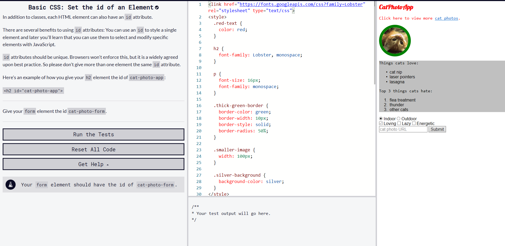

## Welcome to my Portfolio! 

Hello to whoever is looking at this site! I will be presenting what I have learned these passing months!

### C-Sharp 1-4

 I've done quite a few C# WorkShops and I would like to share the best ones with you!

#### Starting C#

Starting C# was the first workshop I've ever done for coding outside of school! It brought me out of my comfort zone and dared me to  try new things! This was the gate way to C# and tought me the in's and out's of the langauge. All the basic variables and quirks of  the system. As well as what I would be dealing with as I carried on through the lessons. This also tought me to be independant with  my learning

#### Working With Classes

Working with classes was the 4th module and 4th workshop I worked through. It taught me about static, public and private  variables, in the context of a class. I also was taught how to affect the class within its self and from the main program. This was  a huge change because of setting static variables I could focus on objecto oriented design instead. This dramaticly increased my   interest in the workshop and has me looking forward to the next workshops comming up.

#### Creating a small game in C#

Creating a small game in C# was the 2nd workshop that I attended. It taught me about the all powerful void and those who dwell in it,  as well as if statements and loops. This was a exciting class that tested my ablities from the prior 1st workshop I did. I was 
 I was also tasked at the end of the class to create an aimbot function that automaticlly hit the target, which I did without a  hitch. This class showed that I retained the information that I had last class and showed that I could refactor code that I made  myself.

#### Sprite Batching/Drawing 

Sprite Batching/Drawing was in the same workshop as making the small game in C# but was a different ordeal in itself. I still don't  understand fully how to Sprite Batch properly but it gave me the gist of the idea. 

#### Khan: Intro to JS: Drawing & Animation

#### Codecamp: Basic JavaScript

#### Codecamp: Basic HTML and HTML5

#### Codecamp: Basic CSS

#### Course content: DanShiftman's Dinosaur Game

#### MISC: Visual Studio

