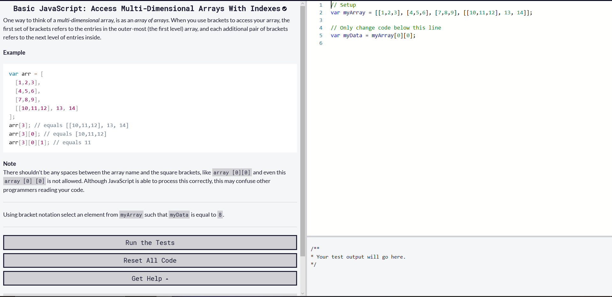

## Welcome to my Portfolio! 

Hello to whoever is looking at this site! I will be presenting what I have learned these passing months!

### C-Sharp 1-4

 I've done quite a few C# WorkShops and I would like to share the best ones with you!

#### Starting C#

#### Working With Classes

#### Creating a small game in C#

#### Sprite Batching/Drawing 

#### Khan: Intro to JS: Drawing & Animation

#### Codecamp: Basic JavaScript

#### Codecamp: Basic HTML and HTML5

#### Codecamp: Basic CSS

#### Course content: DanShiftman's Dinosaur Game

#### MISC: Visual Studio

